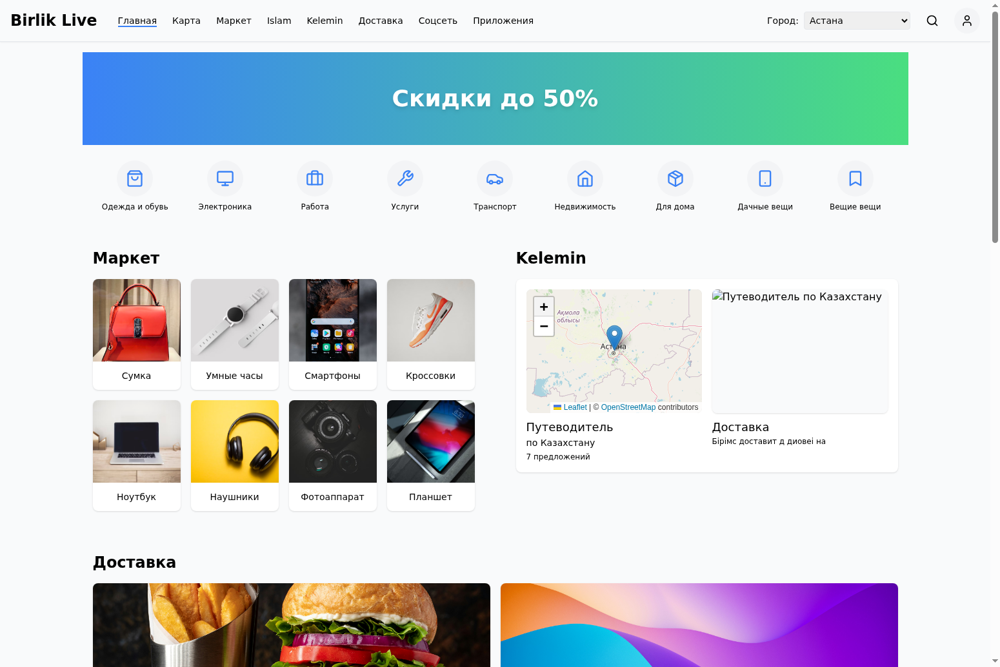

# Birlik Live

Birlik Live - это многофункциональная веб-платформа для Казахстана, объединяющая маркетплейс, путеводитель по стране, информацию об исламе, карты и другие полезные сервисы.



## Содержание

- [Функциональность](#функциональность)
- [Технологии](#технологии)
- [Установка и запуск](#установка-и-запуск)
- [Структура проекта](#структура-проекта)
- [Основные компоненты](#основные-компоненты)
- [Маршрутизация](#маршрутизация)
- [Контекст и состояние](#контекст-и-состояние)
- [Адаптивный дизайн](#адаптивный-дизайн)

## Функциональность

Birlik Live предоставляет следующие функции:

- **Маркет**: Онлайн-маркетплейс для покупки и продажи товаров с возможностью добавления собственных товаров
- **Birlik Taxi**: Интерактивный путеводитель по Казахстану с картой и рекомендациями
- **Islam**: Расписание намазов, хадисы и рекомендации по исламу
- **Карта**: Интерактивная карта Казахстана с возможностью выбора города
- **Личный кабинет**: Регистрация, авторизация и управление профилем
- **Выбор местоположения**: Глобальный выбор города для всех разделов сайта

## Технологии

Проект разработан с использованием следующих технологий:

- **React**: Библиотека для создания пользовательских интерфейсов
- **TypeScript**: Типизированный JavaScript для более надежного кода
- **Vite**: Быстрый инструмент сборки для современных веб-приложений
- **React Router**: Маршрутизация для одностраничных приложений
- **Tailwind CSS**: Утилитарный CSS-фреймворк для стилизации
- **Leaflet**: Библиотека для интерактивных карт
- **React Context API**: Управление глобальным состоянием приложения

## Установка и запуск

### Предварительные требования

- Node.js (версия 16.x или выше)
- npm или yarn

### Шаги установки

1. Клонируйте репозиторий:
   ```bash
   git clone https://github.com/Loamanroy/birlik.git
   cd birlik
   ```

2. Установите зависимости:
   ```bash
   npm install
   # или
   yarn install
   ```

3. Запустите проект в режиме разработки:
   ```bash
   npm run dev
   # или
   yarn dev
   ```

4. Откройте браузер и перейдите по адресу [http://localhost:5173](http://localhost:5173)

### Сборка для продакшена

```bash
npm run build
# или
yarn build
```

Собранные файлы будут находиться в директории `dist`.

## Структура проекта

```
birlik-live/
├── public/             # Статические файлы
├── src/                # Исходный код
│   ├── components/     # Компоненты React
│   │   ├── auth/       # Компоненты аутентификации
│   │   ├── layout/     # Компоненты макета (Header, Footer)
│   │   ├── sections/   # Секции главной страницы
│   │   ├── shared/     # Общие компоненты
│   │   └── user/       # Компоненты пользователя
│   ├── contexts/       # React контексты
│   ├── data/           # Данные и моки
│   ├── pages/          # Страницы приложения
│   ├── App.css         # Глобальные стили
│   ├── App.tsx         # Корневой компонент
│   └── main.tsx        # Точка входа
├── index.html          # HTML шаблон
├── package.json        # Зависимости и скрипты
├── tsconfig.json       # Конфигурация TypeScript
└── vite.config.ts      # Конфигурация Vite
```

## Основные компоненты

### Главная страница

Главная страница (`HomePage.tsx`) содержит следующие секции:
- Баннер со скидками
- Категории товаров
- Маркет с товарами
- Birlik Taxi с интерактивной картой
- Доставка
- Рекомендации

### Навигация

Компонент `Header.tsx` содержит навигационное меню, логотип, поиск и кнопки авторизации. Активная страница подчеркивается синей линией.

### Карты

Интерактивные карты реализованы с помощью компонента `MapComponent.tsx`, который использует библиотеку Leaflet. Карты присутствуют на следующих страницах:
- Главная страница (секция Birlik Taxi)
- Страница Birlik Taxi
- Страница Карта

### Маркет

Страница Маркет (`MarketPage.tsx`) содержит:
- Фильтры товаров (категории, цена, цвет)
- Плитки товаров с изображениями, названиями и ценами
- Кнопку "Добавить товар"
- Поисковую систему

### Личный кабинет

Система аутентификации включает:
- Страницу входа (`LoginPage.tsx`)
- Страницу регистрации (`RegisterPage.tsx`)
- Страницу восстановления пароля (`ForgotPasswordPage.tsx`)
- Меню пользователя (`UserAccountMenu.tsx`)

## Маршрутизация

Маршрутизация реализована с помощью React Router. Основные маршруты:

- `/` - Главная страница
- `/login` - Страница входа
- `/register` - Страница регистрации
- `/forgot-password` - Восстановление пароля
- `/map` - Карта Казахстана
- `/market` - Маркет
- `/market/add` - Добавление товара
- `/market/:id` - Страница товара
- `/birlik-taxi` - Путеводитель по Казахстану
- `/islam` - Информация об исламе
- `/delivery` - Доставка
- `/social` - Социальная сеть
- `/apps` - Приложения

## Контекст и состояние

Для управления глобальным состоянием используется React Context API:

- `LocationContext.tsx` - Контекст для выбора города, который влияет на отображение товаров в Маркете и расписание намазов в разделе Islam

## Адаптивный дизайн

Сайт полностью адаптивен для всех устройств благодаря использованию Tailwind CSS:

- Мобильные устройства (по умолчанию)
- Планшеты (`sm:` - от 640px)
- Ноутбуки (`md:` - от 768px)
- Десктопы (`lg:` - от 1024px)
- Большие экраны (`xl:` - от 1280px)

Все компоненты, включая карты, адаптируются под размер экрана устройства.
